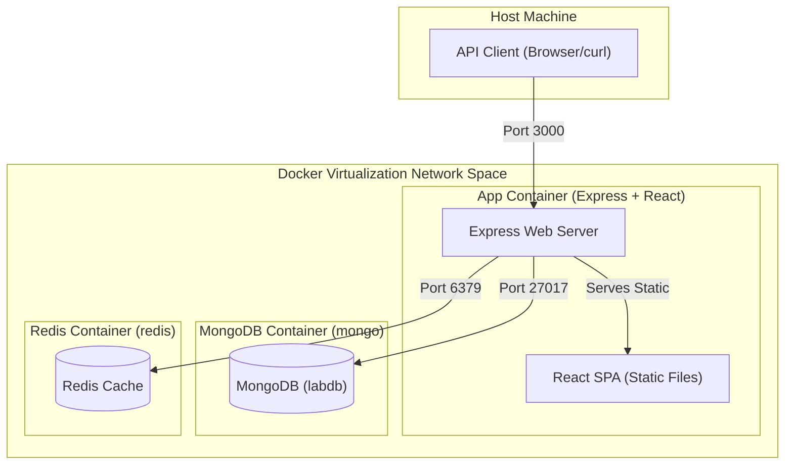

# Node + React + MongoDB + Redis

[](https://nodejs.org/)
[](https://react.dev/)
[](https://www.mongodb.com/)
[](https://redis.io/)
[](https://www.docker.com/)

A full-stack demo application showcasing **Docker networking** with an Express backend, a React (Vite) frontend, MongoDB for persistence, and Redis for caching.

The single multi-stage `Dockerfile` builds the React frontend, copies the production assets into the backend image, and serves everything from a single Express server on port **3000**.

---

## Table of Contents

- [Architecture Diagram](#architecture-diagram)
- [Prerequisites](#prerequisites)
- [Quick Start with Docker Compose](#quick-start-with-docker-compose)
- [Kubernetes](#kubernetes)
- [Local Development (No Docker)](#local-development-no-docker)
- [Building and Pushing to Docker Hub](#building-and-pushing-to-docker-hub)
- [API Endpoints](#api-endpoints)
- [Project Structure](#project-structure)
- [Docker Networking Experiments](#docker-networking-experiments)

---

## Architecture Diagram

The system operates differently depending on the network configuration:



- **app** — Node.js / Express backend that also serves the built React SPA.
- **mongo** — MongoDB 7.0 for document storage.
- **redis** — Redis 7 (Alpine) used as a read-through cache and hit counter.

---

## Prerequisites

| Tool             | Version  |
| ---------------- | -------- |
| Docker           | 24+      |
| Docker Compose   | v2+      |
| Node.js (local)  | 22+      |
| pnpm (local)     | 9.7+     |

> **Note:** Node.js and pnpm are only required for local development without Docker.

---

## Quick Start with Docker Compose

```bash
# 1. Clone the repository
git clone https://github.com/<your-username>/node-react-mongo-redis.git
cd node-react-mongo-redis

# 2. Build and start all services in detached mode
docker compose up --build -d

# 3. Verify all containers are running
docker compose ps

# 4. Open the app
open http://localhost:3040    # macOS
# or visit http://localhost:3040 in your browser
```

### Stopping the stack

```bash
# Stop and remove containers (data is preserved in volumes)
docker compose down

# Stop and remove containers AND delete volumes (fresh start)
docker compose down -v
```

---

## Kubernetes

A complete, hands-on Kubernetes course built on this project lives in **[`k8s/`](k8s/README.md)** —
14 steps from Namespace to Helm, every manifest applied to a real cluster and verified.

```bash
cd k8s
kubectl apply -f 01-namespace/namespace.yaml
kubectl config set-context --current --namespace=node-react-mongo-redis
open README.md
```

| # | Step | # | Step |
| - | ---- | - | ---- |
| 1 | [Namespace](k8s/01-namespace/README.md) | 8 | [ConfigMap & Secret](k8s/08-configmap-secret/README.md) |
| 2 | [Pod](k8s/02-pod/README.md) | 9 | [PersistentVolume & PVC](k8s/09-persistent-volume/README.md) |
| 3 | [Labels & Selectors](k8s/03-labels-selectors/README.md) | 10 | [Jobs](k8s/10-jobs/README.md) |
| 4 | [ReplicaSet](k8s/04-replicaset/README.md) | 11 | [HPA](k8s/11-hpa/README.md) |
| 5 | [Deployment](k8s/05-deployment/README.md) | 12 | [Rolling Updates & Rollbacks](k8s/12-rolling-update-rollback/README.md) |
| 6 | [Service](k8s/06-service/README.md) | 13 | [Probes](k8s/13-probes/README.md) |
| 7 | [Port Forwarding](k8s/07-port-forward/README.md) | 14 | [Helm & Helmfile](k8s/14-helm/README.md) |

Or skip to the finished product:

```bash
helm install nrmr ./k8s/14-helm/nrmr -f k8s/14-helm/environments/prod.yaml \
  -n node-react-mongo-redis --create-namespace --wait
helm test nrmr -n node-react-mongo-redis --logs
```

### Optional credentials

The backend accepts **optional** `MONGO_USER` / `MONGO_PASSWORD` / `REDIS_PASSWORD`
so the Kubernetes lab can demonstrate Secrets with real authentication. When they
are unset the connection strings are byte-for-byte what they always were, so the
Docker Compose stack above is unaffected.

`APP_VERSION` is a build arg stamped into the image and reported at `GET /api/`,
which makes a Kubernetes rolling update observable:

```bash
docker build --build-arg APP_VERSION=v2 -t <username>/node-react-mongo-redis-app:v2 .
```

---

## Local Development (No Docker)

For a faster dev-loop you can run MongoDB and Redis on your host (or via Docker) and start the backend and frontend separately.

### 1. Start MongoDB and Redis

If you don't have them installed locally, spin them up quickly:

```bash
docker run -d --name mongo -p 27017:27017 mongo:7.0
docker run -d --name redis -p 6379:6379 redis:7-alpine
```

### 2. Start the backend

```bash
cd backend
pnpm install
MONGO_HOST=localhost REDIS_HOST=localhost pnpm dev
# Backend now listening on http://localhost:3000
```

### 3. Start the frontend (Vite dev server with HMR)

```bash
cd frontend
pnpm install
pnpm dev
# Frontend now at http://localhost:5173 (proxies /api → localhost:3000)
```

---

## Building and Pushing to Docker Hub

### 1. Log in to Docker Hub

```bash
docker login
```

### 2. Build and tag the image

Replace `<username>` with your Docker Hub username:

```bash
docker build -t <username>/node-react-mongo-redis:latest .
```

### 3. Push the image

```bash
docker push <username>/node-react-mongo-redis:latest
```

### 4. (Optional) Multi-platform build with Buildx

To build for both `linux/amd64` and `linux/arm64` (e.g., for Apple Silicon and cloud servers):

```bash
docker buildx create --use --name multiplatform
docker buildx build \
  --platform linux/amd64,linux/arm64 \
  -t <username>/node-react-mongo-redis:latest \
  --push .
```

### 5. Using the published image

Once pushed, you can pull and run the image anywhere:

```bash
docker pull <username>/node-react-mongo-redis:latest
```

Or update the `docker-compose.yml` to use your published image instead of a local build:

```yaml
services:
  app:
    image: <username>/node-react-mongo-redis:latest   # ← use this instead of build: .
    # build: .                                         # ← comment this out
```

---

## API Endpoints

| Method | Endpoint             | Description                                         |
| ------ | -------------------- | --------------------------------------------------- |
| GET    | `/api/health`        | Returns `{ "status": "ok" }`. Touches **no** dependency — safe as a Kubernetes liveness probe |
| GET    | `/api/`              | Lists all available endpoints, plus `version` and `hostname` |
| GET    | `/api/network-info`  | Shows container hostname, configured hosts, and connectivity status for Mongo & Redis |
| GET    | `/api/items`         | Fetches all items directly from MongoDB             |
| POST   | `/api/items`         | Creates a new item (`{ "name": "..." }`)            |
| GET    | `/api/items/cached`  | Fetches items via Redis cache (30 s TTL), falls back to MongoDB |
| GET    | `/api/counter`       | Increments and returns a Redis hit counter          |

---

## Project Structure

```
node-react-mongo-redis/
├── backend/
│   ├── package.json          # Express + mongodb + redis dependencies
│   └── src/
│       └── index.js          # API server, serves React build as static files
├── frontend/
│   ├── package.json          # React + Vite dependencies
│   ├── vite.config.js        # Dev proxy: /api → localhost:3000
│   └── src/
│       ├── main.jsx          # React entry point
│       └── App.jsx           # Main UI component
├── k8s/                      # ← Kubernetes course: 14 steps, Namespace → Helm
│   ├── README.md             #   start here
│   ├── 01-namespace/ … 13-probes/
│   └── 14-helm/              #   chart + helmfile (dev/prod environments)
├── .dockerignore             # Files excluded from Docker build context
├── Dockerfile                # Multi-stage: builds frontend, packages into backend
├── docker-compose.yml        # Full stack: app + mongo + redis
└── README.md                 # ← You are here
```

---

## Docker Networking Experiments

This project was designed for experimenting with Docker's networking modes. The `/api/network-info` endpoint (and the **Network info** panel in the React UI) reports:

- The container's hostname
- Configured MongoDB/Redis host and port
- Whether MongoDB and Redis are **reachable** from the app container

### Bridge network (default)

The `docker-compose.yml` uses a custom bridge network (`app-network`). All three services discover each other by their service names (`mongo`, `redis`).

```bash
docker compose up --build -d
curl http://localhost:3040/api/network-info
```

### Testing connectivity

```bash
# Add an item to MongoDB
curl -X POST http://localhost:3040/api/items \
  -H "Content-Type: application/json" \
  -d '{"name": "hello world"}'

# Read items (from cache or Mongo)
curl http://localhost:3040/api/items/cached

# Bump the Redis counter
curl http://localhost:3040/api/counter
```

---

## License

This project is provided as a learning resource. Feel free to use and modify it.
